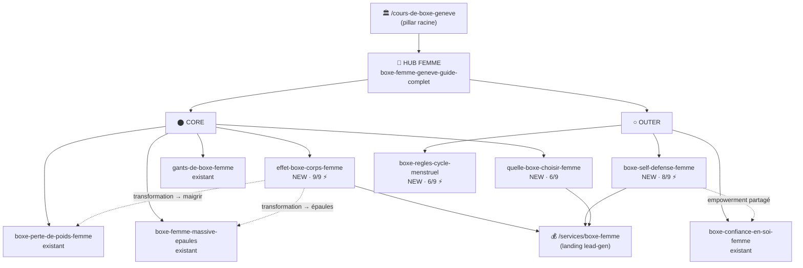

# Topical Map : Boxe femme Genève (expansion Layer 1)

> Généré le 2026-07-02. Cluster de 9 pièces : 6 existantes (1 hub + 4 spokes + 1 landing), 4 à créer.
> Marché : Genève + agglo, femmes 25-50 ans (Sous-persona B). Source de vérité : ce fichier.
> Mode : expansion d'un cluster **existant** (pas un map from scratch). Le hub femme existe déjà.
> Focus projet #1 = femmes (valeur + lead-gen). Lead-gen → `/services/boxe-femme`.

## Contexte data (GSC au 2026-06-30)

- Le cluster femme est **déjà le moteur du site** : `boxe-perte-de-poids-femme-geneve` = page #1 (470 imp/28j, pos 6.9), landing `/services/boxe-femme` = meilleur convertisseur (CTR 7.6 %).
- Positions correctes (pos 4-10) mais impressions individuelles minuscules → **problème de couverture, pas de ranking**. L'expansion vise à élargir le terrain sémantique féminin capté.
- Gaps GSC exploités : « effet de la boxe sur le corps femme » (pos 4.2, quasi-win à consolider), « boxe avant après corps femme », self-défense femme (0 imp = white space), sous-cluster comparatif/décomposition non couvert.

---

## Hiérarchie thématique

### Pillar racine du site : /cours-de-boxe-geneve
Tous les spokes femme **remontent** vers ce pillar (maillage ascendant).

### Hub du cluster femme (sub-pillar) : « Boxe femme débutante » — /blog/boxe-femme-geneve-guide-complet
Keyword : boxe femme Genève · boxe pour femme débutante | Intent : Informationnel | Statut : **Existant**
> C'est la page hub informationnelle du cluster. Absorbe les synonymes « boxe féminine », « cours boxe féminin », « boxe débutant femme » (cf. Cannibalisation).

#### Cluster Silhouette / corps — Core
- boxe-perte-de-poids-femme-geneve — « La boxe fait-elle maigrir » **Existant** (page #1)
- boxe-femme-massive-epaules-geneve — « La boxe rend-elle massive » **Existant**
- effet-boxe-corps-femme-geneve — panorama transformation avant/après **À créer** ⚡

#### Cluster Bénéfices / empowerment — Outer
- boxe-confiance-en-soi-femme-geneve — confiance en soi **Existant**
- boxe-self-defense-femme-geneve — la boxe comme self-défense **À créer** ⚡

#### Cluster Décomposition / pratique — Core
- gants-de-boxe-femme-debutante — équipement **Existant**
- boxe-regles-cycle-menstruel — s'entraîner pendant le cycle **À créer** ⚡ [Outer]

#### Cluster Comparatif / choix — Core (commercial)
- quelle-boxe-choisir-femme-geneve — quelle boxe / quel sport de combat pour une femme **À créer**

#### Conversion — Transactionnel
- /services/boxe-femme — landing service **Existant** (cible de lead-gen de tout le cluster)

#### Déjà planifié (ne pas remapper)
- Ménopause + grossesse/post-partum — planifié S21 (6 sept). Vrais splits femme-spécifiques.

---

## Carte visuelle (Mermaid)

> Visuel de lecture. Pour approfondir un spoke : copier sa commande `--mode deepen` du mini-brief.

---

## Couverture fan-out (Central Entity : « boxe femme Genève »)

- **Reformulation** : hub guide-complet (boxe féminine / cours boxe femme / boxe débutante femme — synonymes absorbés)
- **Décomposition** : gants-de-boxe-femme, boxe-regles-cycle-menstruel (NEW), + première séance (dans le hub)
- **Comparaison** : quelle-boxe-choisir-femme (NEW) ← axe précédemment vide, désormais couvert
- **Implication** : boxe-confiance-en-soi, boxe-self-defense-femme (NEW), effet-boxe-corps-femme (NEW), + ménopause/grossesse (planifiés)
- **Trous détectés** : aucun sur le Layer 1 après ces 4 ajouts. Prochaine profondeur = Layer 2 data-driven (`deepen` sur perte-de-poids ou self-défense quand ils rankent).

---

## Tableau de production

Trié par score décroissant. Produire dans cet ordre.

| # | Article | Sec. | Statut | Brand | Bus./Compl. | Trafic | Score | ⚡ | Module | Slug |
|---|---|---|---|---|---|---|---|---|---|---|
| 1 | Effet de la boxe sur le corps d'une femme (avant/après) | Outer | À créer | 3 | 3 | 3 | **9** | ⚡ | Informationnel panorama | effet-boxe-corps-femme-geneve |
| 2 | La boxe comme self-défense pour les femmes | Outer | À créer | 3 | 3 | 2 | **8** | ⚡ | B (persona) | boxe-self-defense-femme-geneve |
| 3 | Quelle boxe / quel sport de combat pour une femme | Core | À créer | 2 | 2 | 2 | **6** | | E (comparatif) | quelle-boxe-choisir-femme-geneve |
| 4 | Boxe et cycle menstruel : s'entraîner pendant les règles | Outer | À créer | 2 | 3 | 1 | **6** | ⚡ | Informationnel | boxe-regles-cycle-menstruel |

---

## Intent Layering (cluster femme complet, hors landing = 9 articles)

- **Informationnel** : ~78 % (7/9 : hub, perte-poids, confiance, massive-épaules, effet-corps, self-défense, règles)
- **Commercial** : ~11 % (1/9 : quelle-boxe-choisir + gants mi-commercial)
- **Transactionnel** : landing `/services/boxe-femme`
- **Analyse** : équilibre sain, dominante informationnelle idéale pour les citations AI Overviews (99,9 % des AIO = intent info). Le commercial est suffisamment servi par `quelle-boxe-choisir` + `prix-cours-boxe-geneve-2026` (cluster prix existant). Pas de sur-transactionnalité. **OK.**

---

## Blueprint de maillage interne

Règle : tout spoke femme → **hub femme** (haut) + **pillar racine** `/cours-de-boxe-geneve` + **landing** `/services/boxe-femme` (conversion bas de page).

| Article | Liens sortants obligatoires | Liens sortants recommandés | Liens entrants attendus |
|---|---|---|---|
| effet-boxe-corps-femme-geneve | hub femme, /cours-de-boxe-geneve | boxe-perte-de-poids-femme (deep-dive maigrir), boxe-femme-massive-epaules (deep-dive épaules), /services/boxe-femme | hub femme, perte-poids, massive-épaules |
| boxe-self-defense-femme-geneve | hub femme, /cours-de-boxe-geneve | boxe-confiance-en-soi-femme (empowerment), /services/boxe-femme, /contact | hub femme, confiance-en-soi |
| quelle-boxe-choisir-femme-geneve | hub femme, /cours-de-boxe-geneve | boxe-perte-de-poids-femme, /services/boxe-femme | hub femme |
| boxe-regles-cycle-menstruel | hub femme, /cours-de-boxe-geneve | boxe-perte-de-poids-femme, (ménopause qd publié) | hub femme |

> Ancres descriptives, jamais « cliquez ici ». Le hub femme doit **ajouter des liens entrants** vers les 4 nouveaux spokes une fois publiés.

---

## Mini-briefs — articles à créer

### 1. Effet de la boxe sur le corps d'une femme (avant/après)

- Slug : effet-boxe-corps-femme-geneve
- Slug rationale : reprend la query exacte pos 4.2 (« effet de la boxe sur le corps femme ») + géo.
- Type de page : article (spoke)
- Keyword principal : effet de la boxe sur le corps femme
- Section : Outer (panorama de complétude — ne cherche PAS à ranker « maigrir » ou « massive »)
- Sous-requêtes fan-out couvertes : effet boxe corps femme · boxe avant après corps femme · comment la boxe transforme le corps · résultats boxe femme 3-6 mois
- Module : Informationnel panorama — vue d'ensemble de la transformation (posture, tonicité globale, endurance, énergie) sur 3-6 mois, avec renvoi vers les deux deep-dives.
- Intent : Informationnel
- Score : 9/9 (Brand 3 · Complétude 3 · Trafic 3) ⚡ information-gain (cas clients avant/après réels, retours de Nicolas)
- Word count cible : 1 400-1 800 mots
- Lien sortant obligatoire vers : boxe-femme-geneve-guide-complet, /cours-de-boxe-geneve
- Lien sortant recommandé vers : boxe-perte-de-poids-femme-geneve, boxe-femme-massive-epaules-geneve, /services/boxe-femme
- ⚠️ Anti-cannibalisation : PANORAMA. Mentionne perte de poids + silhouette mais **linke** vers les deep-dives au lieu de les ré-traiter. Primary distinct des deux (« effet sur le corps » ≠ « fait maigrir » ≠ « rend massive »).
- A produire avec : /seo-brief effet-boxe-corps-femme-geneve
- Approfondir ce spoke (Layer 2) : /seo-topical-map "transformation corps boxe femme" --mode deepen

### 2. La boxe comme self-défense pour les femmes

- Slug : boxe-self-defense-femme-geneve
- Slug rationale : query « self défense femme Genève » + entité boxe, cadre le silo dans le core métier.
- Type de page : article (spoke)
- Keyword principal : boxe self défense femme Genève
- Section : Outer (bâtit le trust + capte une intention adjacente forte ; convertit vers la landing)
- Sous-requêtes fan-out couvertes : self défense femme Genève · la boxe pour se défendre · boxe ou krav maga femme · cours self défense femme
- Module : B (angle persona — la femme qui veut se sentir capable de se défendre)
- Intent : Informationnel (avec pull commercial fort)
- Score : 8/9 (Brand 3 · Business 3 · Trafic 2) ⚡ information-gain (positionnement honnête : ce que la boxe apporte vraiment vs un cours self-défense pur)
- Word count cible : 1 400-1 700 mots
- Lien sortant obligatoire vers : boxe-femme-geneve-guide-complet, /cours-de-boxe-geneve
- Lien sortant recommandé vers : boxe-confiance-en-soi-femme-geneve, /services/boxe-femme, /contact
- ⚠️ White space : concurrents = Krav Maga / MAA / plateformes (coachs-sportifs, superprof). Angle différenciant = studio premium bienveillant + honnêteté (la boxe ≠ self-défense complète mais donne réflexes, distance, confiance, cardio d'urgence).
- A produire avec : /seo-brief boxe-self-defense-femme-geneve
- Approfondir ce spoke (Layer 2) : /seo-topical-map "self défense femme boxe" --mode deepen  [Layer-2 candidate si traction GSC]

### 3. Quelle boxe / quel sport de combat pour une femme

- Slug : quelle-boxe-choisir-femme-geneve
- Slug rationale : intention de choix/comparaison, cadré femme + géo.
- Type de page : article (spoke)
- Keyword principal : quel sport de combat pour une femme
- Section : Core (commercial — oriente vers l'offre boxe anglaise du studio)
- Sous-requêtes fan-out couvertes : quel sport de combat pour femme · boxe anglaise vs thai femme · boxe ou fitness pour maigrir femme · quelle boxe débuter femme
- Module : E (comparatif / best-of) — comparer boxe anglaise vs thaï/kickboxing vs fitness-boxing, pour quel objectif (défoulement, silhouette, technique), et pourquoi la boxe anglaise en 1-1 convient à la débutante.
- Intent : Commercial
- Score : 6/9 (Brand 2 · Business 2 · Trafic 2)
- Word count cible : 1 200-1 600 mots
- Lien sortant obligatoire vers : boxe-femme-geneve-guide-complet, /cours-de-boxe-geneve
- Lien sortant recommandé vers : boxe-perte-de-poids-femme-geneve, /services/boxe-femme
- ⚠️ Anti-cannibalisation : c'est un COMPARATIF (« lequel choisir »), pas un « combien ça coûte » (→ prix-cours-boxe-geneve-2026) ni la « première séance » (→ hub).
- A produire avec : /seo-brief quelle-boxe-choisir-femme-geneve
- Approfondir ce spoke (Layer 2) : /seo-topical-map "sports de combat femme comparatif" --mode deepen

### 4. Boxe et cycle menstruel : s'entraîner pendant les règles

- Slug : boxe-regles-cycle-menstruel
- Slug rationale : vrai split femme-spécifique, query longue-traîne claire (pas de géo car sujet non-local).
- Type de page : article (spoke)
- Keyword principal : boxe pendant les règles
- Section : Outer (complétude femme-spécifique + trust ; comble un trou du fan-out décomposition)
- Sous-requêtes fan-out couvertes : boxe pendant les règles · sport de combat cycle menstruel · s'entraîner pendant ses règles · boxe et hormones femme
- Module : Informationnel — adapter l'intensité selon les phases du cycle, énergie, ce qui est mythe vs réalité.
- Intent : Informationnel
- Score : 6/9 (Brand 2 · Complétude 3 · Trafic 1) ⚡ information-gain (angle rarement traité honnêtement par un studio)
- Word count cible : 1 000-1 400 mots
- Lien sortant obligatoire vers : boxe-femme-geneve-guide-complet, /cours-de-boxe-geneve
- Lien sortant recommandé vers : boxe-perte-de-poids-femme-geneve, (ménopause quand publié S21)
- ⚠️ Vrai split (les 3 cases OK) : la requête existe · réponse 100 % spécifique femme · besoin distinct. Ne PAS diluer dans le hub.
- A produire avec : /seo-brief boxe-regles-cycle-menstruel
- Approfondir ce spoke (Layer 2) : non — sujet fin, reste un spoke.

---

## Cannibalisation détectée / gérée

| Query GSC | Traitement | Action |
|---|---|---|
| « boxe féminine » / « boxe pour femme » (pos 6, 2 imp) | **Faux split** — synonyme du hub | Absorber comme keyword secondaire dans `boxe-femme-geneve-guide-complet` + landing. Aucun article dédié. |
| « boxe débutant femme » (pos 10, 3 imp) | **Faux split** — c'est LE hub | Déjà servi par le hub (« Boxe femme débutante »). Renforcer le H1/intro. |
| « effet corps femme » vs perte-poids vs épaules | Panorama vs 2 deep-dives | Résolu : `effet-boxe-corps-femme` = panorama qui LINKE, primaries distincts (cf. mini-brief #1). |
| « quelle boxe » vs prix vs première séance | Comparatif vs commercial vs guide | Résolu : intentions distinctes (choisir ≠ coûter ≠ démarrer). |

> Aucun conflit bloquant. Les 2 faux splits sont des **optimisations on-page** du hub existant, pas des articles.

---

## Discipline de production (rappel)

1. Produire les 4 spokes dans l'ordre du tableau, **finir et mailler le Layer 1 à 100 %** avant toute expansion Layer 2.
2. Ajouter les liens entrants du hub vers les 4 nouveaux spokes une fois publiés.
3. Attendre la traction GSC (2-3 sem) → `/seo-gsc` révèlera quel spoke `deepen` en Layer 2 (candidats : self-défense, perte-de-poids).
4. Ménopause + grossesse restent sur le planning S21 — ne pas les avancer ici.
